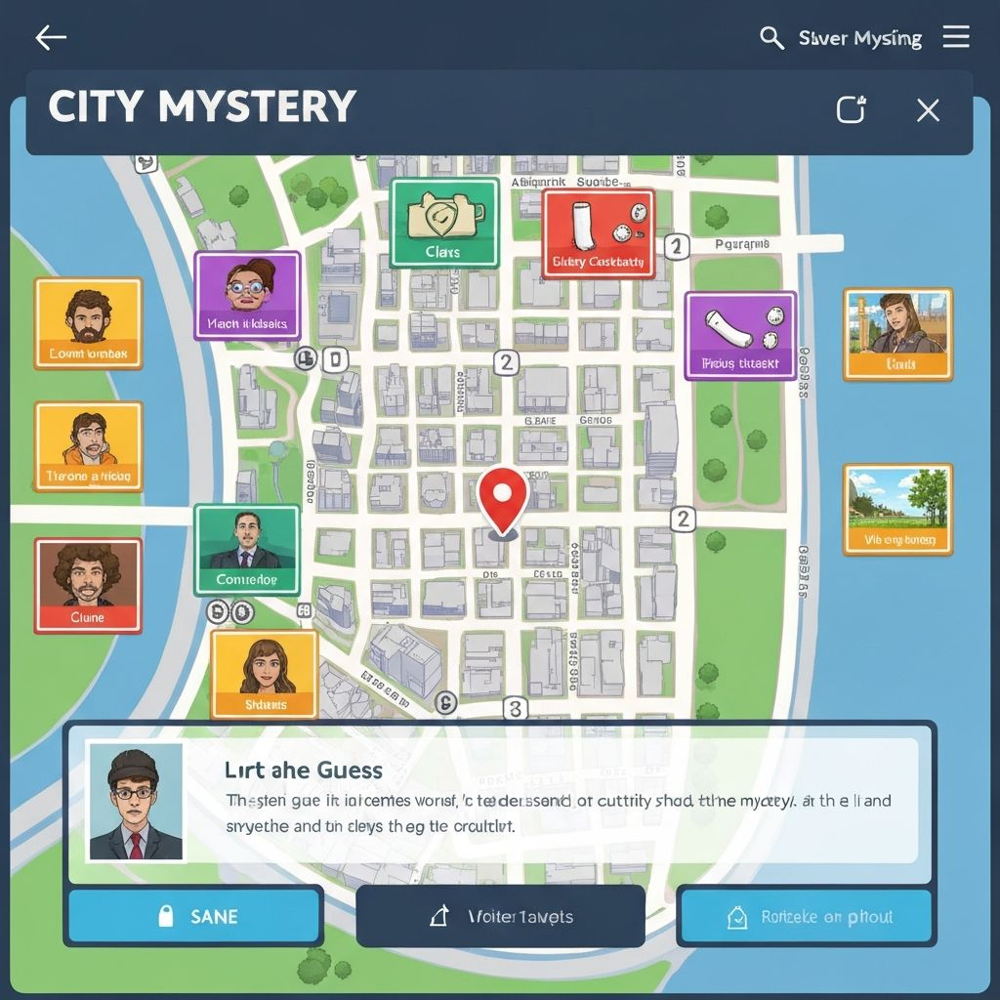

# 🌍 City Mystery AI Explorer

An interactive geography mystery game where players guess cities based on AI-generated clues. Built with Next.js, Supabase, and the Vercel AI SDK.

## ✨ Features

### 🎮 Multiple Game Modes

- **World Mode**: Explore cities from around the globe
- **Ethiopia Legend Mode**: Discover Ethiopia's historic cities (Premium only)
- **AI Mode**: Play with dynamically AI-generated cities and clues

### 🎯 Gameplay Mechanics

- Progressive clue system (4 clues per city)
- Dynamic scoring: 100 → 70 → 40 → 20 points based on clues used
- Interactive map with progressive blur effect reveals location
- 3 lives per game
- AI-powered hint system for when you're stuck

### 💎 Monetization

- **Free Tier**: 5 games per day
- **Watch Ads**: Earn bonus points to continue playing
- **Premium Subscription**: 
  - Unlimited games
  - Ad-free experience
  - Access to Ethiopia Legend Mode
  - Exclusive features

### 🔐 Authentication

- Email/Password authentication via Supabase
- Secure session management
- User profile tracking
- Game history and statistics

### 💳 Payment Integration

- Chapa payment gateway integration
- Multiple subscription tiers:
  - Explorer (Free): 5 games/day
  - Legend (Monthly): 99 ETB
  - Guardian (Yearly): 999 ETB
- Secure payment verification

## 🛠️ Tech Stack

- **Framework**: Next.js 16 (App Router)
- **Language**: TypeScript
- **Styling**: Tailwind CSS v4
- **Database**: Supabase (PostgreSQL)
- **Authentication**: Supabase Auth
- **AI**: Vercel AI SDK (OpenAI models via AI Gateway)
- **Payment**: Chapa Payment Gateway
- **Maps**: Leaflet.js + React Leaflet
- **State Management**: Zustand
- **UI Components**: Radix UI + shadcn/ui

## 📋 Prerequisites

- Node.js 18+ and npm/yarn/pnpm
- Supabase account
- Chapa account (for payment processing)
- Vercel account (optional, for deployment)

## 🚀 Getting Started

### 1. Clone the Repository

\`\`\`bash
git clone <your-repo-url>
cd city-mystery-ai
\`\`\`

### 2. Install Dependencies

\`\`\`bash
npm install
# or
yarn install
# or
pnpm install
\`\`\`

### 3. Set Up Environment Variables

Create a `.env.local` file in the root directory:

\`\`\`env
# Supabase
SUPABASE_URL=your_supabase_project_url
NEXT_PUBLIC_SUPABASE_URL=your_supabase_project_url
SUPABASE_ANON_KEY=your_supabase_anon_key
NEXT_PUBLIC_SUPABASE_ANON_KEY=your_supabase_anon_key
SUPABASE_SERVICE_ROLE_KEY=your_supabase_service_role_key

# Supabase Auth Redirect (for development)
NEXT_PUBLIC_DEV_SUPABASE_REDIRECT_URL=http://localhost:3000

# Chapa Payment
CHAPA_SECRET_KEY=your_chapa_secret_key

# App URL
NEXT_PUBLIC_APP_URL=http://localhost:3000
\`\`\`

### 4. Set Up Supabase Database

Run the SQL scripts in order from the `scripts/` folder in your Supabase SQL Editor:

\`\`\`sql
-- 1. Create users table
-- Run: scripts/001_create_users_table.sql

-- 2. Create ad views tracking table
-- Run: scripts/002_create_ad_views_table.sql

-- 3. Enable Row Level Security
-- Run: scripts/003_enable_rls.sql
\`\`\`

### 5. Run the Development Server

\`\`\`bash
npm run dev
# or
yarn dev
# or
pnpm dev
\`\`\`

Open [http://localhost:3000](http://localhost:3000) in your browser.

## 📁 Project Structure

\`\`\`
city-mystery-ai/
├── app/
│   ├── api/                    # API routes
│   │   ├── ads/               # Ad reward endpoints
│   │   ├── game/              # Game logic & AI generation
│   │   ├── payment/           # Chapa payment integration
│   │   └── user/              # User profile management
│   ├── auth/                  # Authentication pages
│   │   ├── login/
│   │   └── sign-up/
│   ├── payment/               # Payment success/failure pages
│   ├── play/                  # Main game page
│   ├── premium/               # Premium subscription page
│   └── globals.css            # Global styles
├── components/
│   ├── ads/                   # Ad-related components
│   ├── game/                  # Game UI components
│   └── ui/                    # Reusable UI components (shadcn)
├── data/
│   ├── world/                 # World mode city data
│   └── ethiopia/              # Ethiopia mode city data
├── lib/
│   ├── supabase/              # Supabase client utilities
│   ├── chapa.ts               # Chapa payment utility
│   └── utils.ts               # Helper functions
├── store/
│   └── gameStore.ts           # Zustand game state management
├── scripts/                   # Database migration scripts
└── middleware.ts              # Auth middleware
\`\`\`

## 🎮 How to Play

1. **Choose a Mode**: Select World, Ethiopia Legend, or AI mode
2. **Read the Clue**: Start with the first clue about the mystery city
3. **Make a Guess**: Type your answer and submit
4. **Use More Clues**: Reveal additional clues if needed (reduces points)
5. **Win**: Guess correctly before running out of lives!

### Game Mechanics

- **Points System**:
  - 1st clue: 100 points
  - 2nd clue: 70 points
  - 3rd clue: 40 points
  - 4th clue: 20 points

- **Lives**: 3 attempts per game
- **Map Feature**: Progressive blur effect (8px → 6px → 3px → 0px)
- **AI Hints**: Available in AI mode for additional help

## 💰 Premium Features

### Free Users
- 5 games per day
- World mode access
- Watch ads to continue playing
- Standard scoring system

### Premium Users
- Unlimited games
- Ad-free experience
- Ethiopia Legend Mode access
- AI Mode with unlimited hints
- Priority support

## 🔒 Security

- Row Level Security (RLS) enabled on all tables
- Secure authentication with Supabase Auth
- Server-side payment verification
- Environment variables for sensitive data
- Protected API routes

## 🌐 Deployment

### Deploy to Vercel

1. Push your code to GitHub
2. Import project in Vercel
3. Add environment variables in Vercel dashboard
4. Deploy!

### Environment Variables in Production

Make sure to add all environment variables from `.env.local` to your Vercel project settings.

## 📊 Database Schema

### Users Table
\`\`\`sql
- id (uuid, primary key)
- email (text)
- premium_status (boolean)
- subscription_end (timestamp)
- points (integer)
- games_played_today (integer)
- last_game_date (date)
- created_at (timestamp)
\`\`\`

### Ad Views Table
\`\`\`sql
- id (uuid, primary key)
- user_id (uuid, foreign key)
- points_earned (integer)
- created_at (timestamp)
\`\`\`

## 🧪 Testing Payment

Use Chapa's test credentials:
- Test Mode: Available in Chapa dashboard
- Test Cards: Provided by Chapa documentation

## 🤝 Contributing

Contributions are welcome! Please feel free to submit a Pull Request.

## 📝 License

This project is licensed under the MIT License.

## 🙏 Acknowledgments

- [Next.js](https://nextjs.org/)
- [Supabase](https://supabase.com/)
- [Vercel AI SDK](https://sdk.vercel.ai/)
- [Chapa](https://chapa.co/)
- [Leaflet.js](https://leafletjs.com/)
- [shadcn/ui](https://ui.shadcn.com/)

## 📧 Support

For support, email support@citymystery.com or open an issue in the GitHub repository.

---

Built with ❤️ using v0 by Vercel
